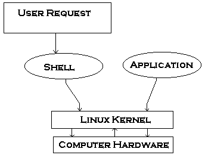

# Basic Introduction



**What is Linux Shell?**

- it is difficult to communicate with computer using zeors and onces so opearting system has a unique program called the shell.
- the shell accepts human-readable commands and translates them into something the kernel can read and process.

**What is Shell?**

- user program or it is an environment provided for user interaction
- executes commands read from standard input
- not a part of system kernel, but uses the system kernel to execute programs
- several shells : ex - BASH
- Various ways to get shell access :
  - TERMINAL
  - SSH ( connect via SSH )
  - CONSOLE

**what is command LIne ?**

- shell provides an interface to Linux where you can type commands using the keyboard it is known as CLI.


2 Rules associated with UNIX Philosophy:

- The rule of Silence : programs should only speak up when there’s an error or critical result
- The Rule of Least Surprise: latter advises designing intuitive interfaces and avoiding unexpected behaviours that confuse user.

**Shell Program:**

- if you store a sequence of commands to a text file and tell the shell to execute the text file instead of entering the commands, that is known as a shell program or shell script.
- shell script : series of commands stored in plain text file.
- `echo "$SHELL"` : which shell you used?

**Why Shell Scripting?**

- useful for automating processes that you repeat at the prompt.
- advantages:

  - Easy to use
  - Quick Start and interactive debugging
  - Time saving
  - Admin Task automation

- command prompt ends with
  - $ : for Regular user
  - "#" : Root user


- Each Bash text has three parts:
  - The command
  - Options that typically start with a `-` or `--`
  - Argument


`type` command used to find out if a command is built in or external binary file.

**What is bash Shebang #! ?**

- absolute path to bash interpreter
- indicate an interpreter for execution under UNIX / Linux operating systems.
- can add argument after the shebang character, which is optional.
- Make sure the interpreter is the full path to a binary file : `/bin/bash`

```bash
#! /path/to/interpreter [arguments]
```

**Debug a Script:**

- `bash -x script-name`
- you can also modify shebang line to run an entire script in debugging mode:
- `*#!/bin/bash -x*`

Bash Shell offeres debugging options which can be turned on or off using set command.

- `set -x` : all commands and their arguments as they are executed
- `set -v` : shell inputs lines as they are read
- `set -n` : read commands but do not executes them. used for find syntax error

New Feature Learn :

Write a shell script that prints out your name and waits for the user to press the [Enter] key before the script ends.

```bash
#!/bin/bash
echo "Harsh Butani"
read -p "press [Enter] key to continue...." fakeEnterKe
```
