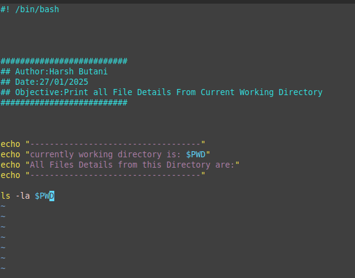
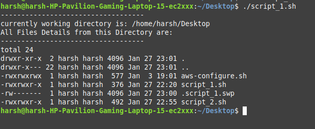

# Script 1.0

Write a Bash script that shows details of all files in the current directory, including their **size, permissions, and other file-related information**.

### **Prerequisites:**

- How to run a Bash script.
- How to give execute permission to a script.
- How to read the manual (`man`) page of a command.

### **Objective:**

- Learn how to write and run a basic Bash script.

### **Requirements:**

- When you execute the script, it should display details of all files in the **current directory**.

Here is The Script That i Wrote :

```bash
#! /bin/bash

##########################
## Author:Harsh Butani
## Date:27/01/2025
## Objective:Print all File Details From Current Working Directory
##########################

echo "-----------------------------------"
echo "currently working directory is: $PWD"
echo "All Files Details from this Directory are:"
echo "-----------------------------------"

ls -la $PWD

```

Here is The output that i Got:

```bash
harsh@harsh-HP-Pavilion-Gaming-Laptop-15-ec2xxx:~/Desktop$ ./script_1.sh
-----------------------------------
currently working directory is: /home/harsh/Desktop
All Files Details from this Directory are:
-----------------------------------
total 24
drwxr-xr-x  2 harsh harsh 4096 Jan 27 23:01 .
drwxr-x--- 22 harsh harsh 4096 Jan 27 23:01 ..
-rwxrwxrwx  1 harsh harsh  577 Jan  3 19:01 aws-configure.sh
-rwxrwxr-x  1 harsh harsh  376 Jan 27 22:20 script_1.sh
-rw-------  1 harsh harsh 4096 Jan 27 23:00 .script_1.swp
-rwxrwxr-x  1 harsh harsh  492 Jan 27 22:55 script_2.sh

```

### Proof of Work:




