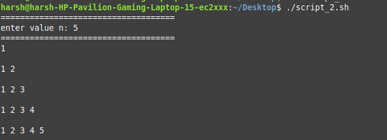
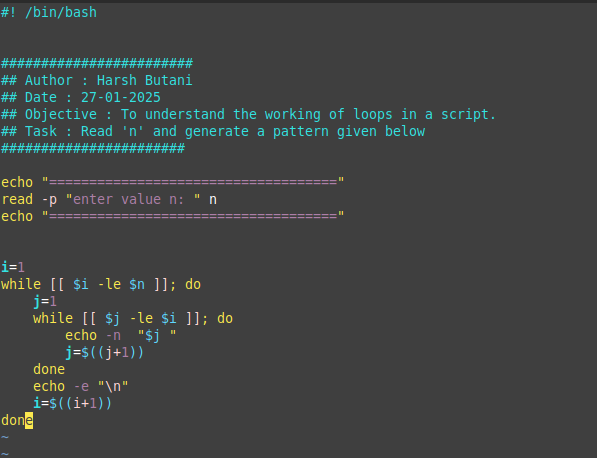

# Script 2.0

**The question is asking you to write a shell script that:**

1. Takes an integer input **n** from the user.
2. Generates a pattern where each row contains numbers starting from **1** up to the row number.
3. The pattern should look like this for **n = 4**:

   ```

   1
   1 2
   1 2 3
   1 2 3 4
   ```

**Prerequisites:**

- You should know how to use loops in shell scripting.
- You should know how to run a Bash script.
- You should know how to give execute permission to a script file.

**Objective:**

- The goal is to practice using loops in shell scripting.

**Requirements:**

- Read a number from the user.
- Use that number to generate the given pattern.

Here is the Script that I write :

```bash
#! /bin/bash

########################
## Author : Harsh Butani
## Date : 27-01-2025
## Objective : To understand the working of loops in a script.
## Task : Read 'n' and generate a pattern given below
#######################

echo "===================================="
read -p "enter value n: " n
echo "===================================="

i=1
while [[ $i -le $n ]]; do
    j=1
    while [[ $j -le $i ]]; do
        echo -n  "$j "
        j=$((j+1))
    done
    echo -e "\n"
    i=$((i+1))
done

```

here is the Output that i got:

```bash
harsh@harsh-HP-Pavilion-Gaming-Laptop-15-ec2xxx:~/Desktop$ ./script_2.sh
====================================
enter value n: 5
====================================
1

1 2

1 2 3

1 2 3 4

1 2 3 4 5

```

### Challenges and Learning:

- I struggle to write nested while loop syntax here is the template for clarity :

```bash
#!/bin/bash

# Outer loop
while [ condition ]; do
    # Inner loop
    while [ condition ]; do
        # Commands to execute
    done
done

```

- how to read input by `read`
- in second loop, every time echo print on next line, which we can prevent by using -e. which continue execution on same line

Here is the Image Output and Script Image:




