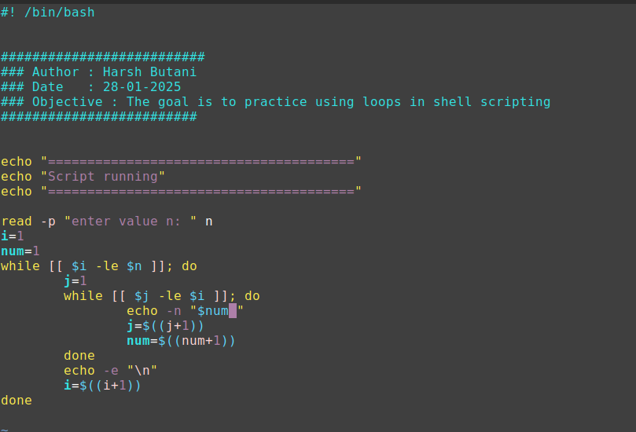
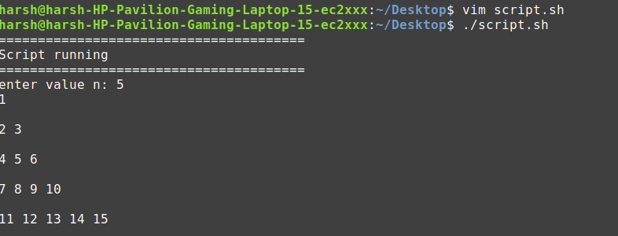

# Script 3.0

## Problem Statement

**A3:** Read 'n' and generate the following pattern:

```
1
2 3
4 5 6
7 8 9 10
```

## Prerequisites

- How to run loops in shell scripts
- How to execute a bash script
- How to change execute permissions of a file

## Objective

- Understand the working of loops in a shell script

## Requirements

- Read a value from the user
- Create the specified pattern

---

## Solution Script

```bash
#! /bin/bash

##########################
### Author : Harsh Butani
### Date   : 28-01-2025
### Objective : Practice using loops in shell scripting
#########################

echo "======================================="
echo "Script running"
echo "======================================="

read -p "Enter value n: " n
i=1
num=1
while [[ $i -le $n ]]; do
    j=1
    while [[ $j -le $i ]]; do
        echo -n "$num "
        j=$((j+1))
        num=$((num+1))
    done
    echo -e "\n"
    i=$((i+1))
done
```

## Output

```bash
harsh@harsh-HP-Pavilion-Gaming-Laptop-15-ec2xxx:~/Desktop$ ./script.sh
=======================================
Script running
=======================================
Enter value n: 5
1

2 3

4 5 6

7 8 9 10

11 12 13 14 15
```

## Proof of Work





---

## Learnings and Challenges

### Important Flags

- **`e`**: Enables interpretation of escape sequences (e.g., `\n` for a new line, `\t` for a tab).
- **`n`**: Prevents a new line at the end of the output.
- **`p`**: Prompts the user with a message before taking input.

### Mistakes and Fixes

1. **Incorrect Read Statement:**

   ```
   read -p "Enter value n" $n
   ```

   **Mistake:** `$n` should be `n` because `read` assigns a value, not retrieves one.

   **Correct:**

   ```
   read -p "Enter value n: " n
   ```

2. **Incorrect While Condition Syntax:**

   ```
   while [[$i -le $n]];
   ```

   **Mistake:** Missing space after `[[`.

   **Correct:**

   ```
   while [[ $i -le $n ]];
   ```

### Why `j=$((j + 1))` Works

- `$(())` is **Arithmetic Expansion**, allowing mathematical calculations.
- `j + 1` is evaluated inside `$(()`, and the result is assigned to `j`.

### Why `j=$j + 1` is Wrong

- `$j + 1` is treated as a **string**, not an arithmetic operation.
- The shell tries to assign `"1 + 1"` (as a string) to `j`, leading to an error.
