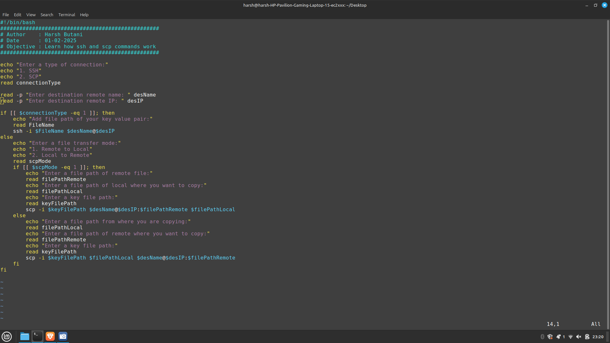
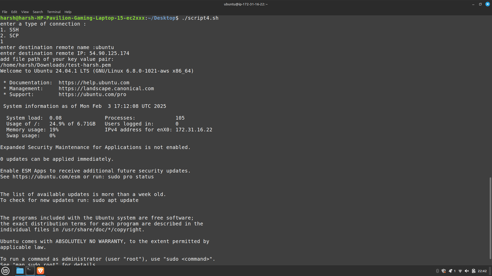
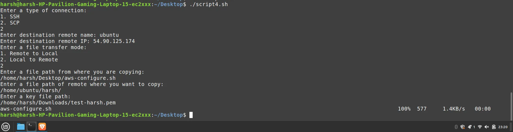

# Script 4.0

<aside>
💡

</aside>

### **Problem Statement:**

**Write a shell script to demonstrate remote login and file transfer using SCP.**

### **Prerequisites:**

- Basic knowledge of `ssh` and `scp` commands.
- Understanding of the `case` statement in shell scripting.
- Ability to copy files/directories using the `cp` command.

### **Objective:**

- Learn how `ssh` and `scp` commands work.

### **Requirements:**

1. Display a menu to choose between SSH (remote login) or SCP (file transfer).
2. Ask for the username and IP address of the remote machine.
3. If SCP is selected:
   - Ask whether the file should be copied **from remote to local** or **local to remote**.
   - Copy the file to the destination home directory with the same name if no filename is provided.
   - If a filename is given with the destination, use it as the new name.
4. The user must enter the correct password for the remote system.

### Useful Resource Related to SCP:

https://phoenixnap.com/kb/linux-scp-command

https://www.digitalocean.com/community/tutorials/how-to-use-ssh-to-connect-to-a-remote-server

### Brief Flow :

- two option : `SSH` or `SCP` ?
- if SSH:
  - take `username` / `IP addresses` of remote server
- if SCP :
  - take `username` / `IP addresses` of remote server
  - two option : `remote to Local` or `Local to remote`

Action : coped file from source to destination with given name. if no name then default .

```bash
echo "1. SSH"
echo "2. SCP"
read n

if n = 1
	read -n "enter destination remote name" desName
	read -n "enter destination remote IP" desIP

	// perform SSH
else
	read -n "enter destination remote name" desName
	read -n "enter destination remote IP" desIP
	echo "1. remote to local"
	echo "2. local to remote"
	read i

	// perform SCP
```

### Script Image:



### **SSH output:**



### **SCP output:**



### Problems and Challenges:

Here are the mistakes you encountered while troubleshooting the errors in your initial script:

1. **Incorrect Variable Reference in Command (`cmd1`)**:
   - **Mistake**: In first script, the variable `cmd1` was set as `cmd1="ssh -i /Downlode/FileName $desName@$desIp"`, but it incorrectly referenced the variable `FileName` as a string (`/Downlode/FileName`) instead of using the variable `$FileName`.
   - **Solution**: The path and filename should be referenced as `$FileName` instead of the literal string.
2. **Incorrect File Permissions for SSH Key**:
   - **Mistake**: When using SSH keys, they must have proper permissions (i.e., `chmod 600` on the private key file). If the key file permissions are too open, the connection will be refused.
   - **Solution**: Change file permissions using `chmod 600 /path/to/key.pem`.
3. **Misuse of Variables (`desIp` vs `desIP`)**:
   - **Mistake**: There was a typo in the variable name. The correct variable was `$desIP`, but you used `$desIp` in your script.
   - **Solution**: Ensure consistent variable names are used throughout the script.
4. **Inconsistent File Path Handling in SCP Command**:
   - **Mistake**: The SCP command failed due to incorrect paths and improper handling of the remote file path (e.g., `/home/ubuntu/harsh` should specify a real file or directory).
   - **Solution**: Ensure you provide the correct paths and ensure that the destination is a valid directory or file on the remote server.
5. **Syntax Errors in Command Execution**:
   - **Mistake**: When executing SSH or SCP commands, the `$cmd1` command variable was mistakenly invoked without proper references to variables, leading to errors in execution.
   - **Solution**: Properly reference the variables within the commands, such as `$desName`, `$desIP`, and `$FileName`.
6. **Incorrect Command Usage for SCP**:
   - **Mistake**: For the SCP command, you missed the `i` option to specify the key file, causing permission errors during the file transfer.
   - **Solution**: Include the `i` flag followed by the key file path (e.g., `scp -i $keyFilePath`).

**File That i Wrote early with lot of Mistakes:**

```bash
#! /bin/bash
##################################################
# Author    : Harsh Butani
# Date      : 01-02-2025
# Objective : Learn how ssh and scp commands work
##################################################

echo "enter a type of connection"
echo "1. SSH"
echo "2. SCP"
read connectionType

read -p "enter destination remote name" desName
read -p "enter destination remote IP" desIP
FileName="Downlode/test-harsh.pem"
cmd1="ssh -i /Downlode/FileName $desName@$desIp"

if [[ $connectionType -eq 1 ]]; then
	echo "add file path of your key value pair"
	read FileName
	$cmd1
else
	echo "enter a file transfer mode"
	echo "1. remote to local"
	echo "2. local to remote"
	read scpMode
	if [[ scpMode -eq 1 ]]; then
			echo "enter a file path of remote file"
			read filePathRemote
			echo "enter a file path of local where you want to copy"
			read filePathLocal
			scp $desIp:$filePathRemote $filePathLocal
	else
		echo "enter a file path from where you are copied"
		read filePathLocal
		echo "enter a file path of remote where you want to copy"
		read filePathRemote
		scp $filePathLocal  $desIp:$filePathRemote
	fi
fi

```

### **Final Script**

```bash
#!/bin/bash
##################################################
# Author    : Harsh Butani
# Date      : 01-02-2025
# Objective : Learn how ssh and scp commands work
##################################################

echo "Enter a type of connection:"
echo "1. SSH"
echo "2. SCP"
read connectionType

read -p "Enter destination remote name: " desName
read -p "Enter destination remote IP: " desIP

if [[ $connectionType -eq 1 ]]; then
    echo "Add file path of your key value pair:"
    read FileName
    ssh -i $FileName $desName@$desIP
else
    echo "Enter a file transfer mode:"
    echo "1. Remote to Local"
    echo "2. Local to Remote"
    read scpMode
    if [[ $scpMode -eq 1 ]]; then
        echo "Enter a file path of remote file:"
        read filePathRemote
        echo "Enter a file path of local where you want to copy:"
        read filePathLocal
        echo "Enter a key file path:"
        read keyFilePath
        scp -i $keyFilePath $desName@$desIP:$filePathRemote $filePathLocal
    else
        echo "Enter a file path from where you are copying:"
        read filePathLocal
        echo "Enter a file path of remote where you want to copy:"
        read filePathRemote
        echo "Enter a key file path:"
        read keyFilePath
        scp -i $keyFilePath $filePathLocal $desName@$desIP:$filePathRemote
    fi
fi

```

### **Syntax for SSH:**

```bash
#ssh to connect remote server
ssh -i [key_file_path] [remote_username]@[remote_IP]

# scp to send file remote to local
scp -i [key_file_path] [remote name]@[remote IP]:[remote location] [local path]

# send file local to remote
scp -i [key_value_file path] [local path] [remote name]@[remoet IP]:[remote path]
```

### **Key Learning:**

- First All Basic Step should be clear First For ex : File Execution permission etc.
- Check your Syntax 10 times from different resources and pick up which you find frequently
