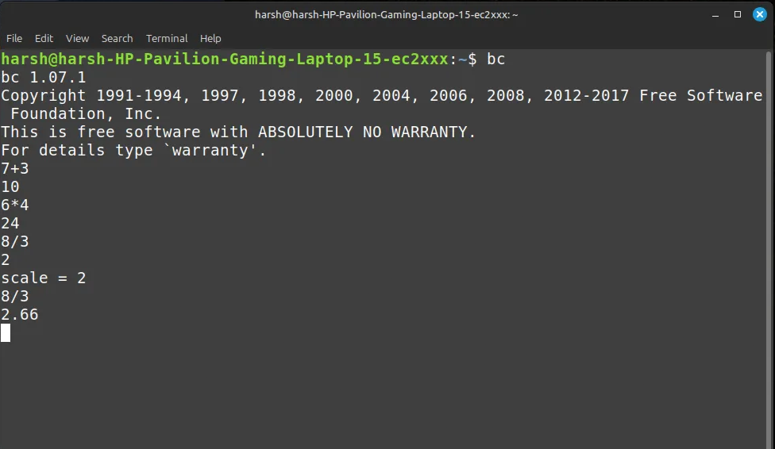
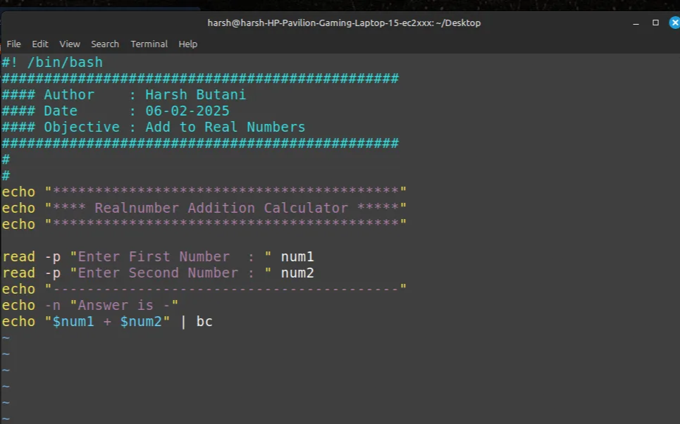
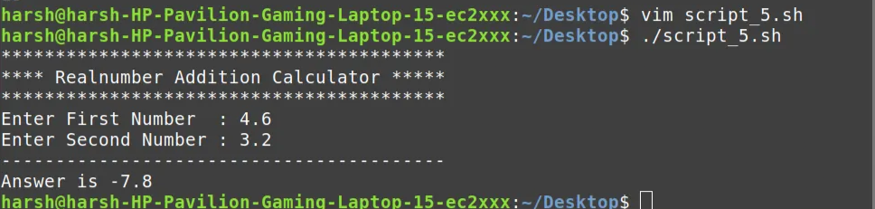
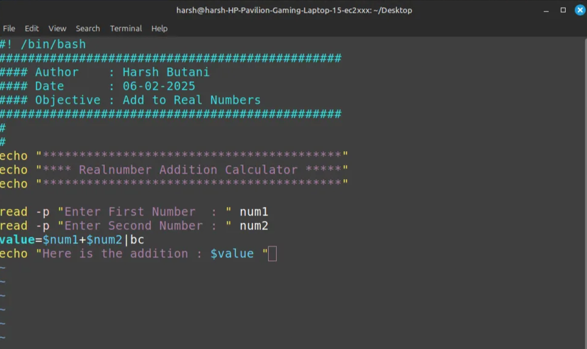

# Script 5.0

### **Prerequisites:**

- Understanding how to add real numbers in a script
- Using piping in commands

### **Objective:**

- Learn how piping works
- Perform arithmetic operations in a shell script

### **Requirements:**

- Prompt the user to enter two numbers (integers or real numbers)
- Use the `bc` command and piping to perform the addition

---

**Exploring Real Number Operations in Bash**

While researching how to handle real numbers in Bash, I discovered the **`bc` (Basic Calculator)** command. Initially, it seemed like a simple command, but as I explored further, I was amazed by its capabilities.

### **Understanding `bc` Command**

<aside>
💡

`bc` is a powerful command-line calculator in Linux that supports:

</aside>

✅ Arithmetic operations

✅ Variables

✅ Loops

✅ Functions

✅ Arbitrary precision

---

### **Basic Arithmetic Operations with `bc`**

```bash

echo "5 + 3" | bc       # Output: 8
echo "10 - 4" | bc      # Output: 6
echo "6 * 2" | bc       # Output: 12
echo "10 / 3" | bc      # Output: 3  (Integer division)
echo "10 % 3" | bc      # Output: 1  (Modulo)

```



### **Handling Decimal Division with `scale`**

By default, `bc` performs integer division. To get decimal results, we use `scale`:

```bash
echo "scale=2; 10 / 3" | bc   # Output: 3.33
echo "scale=5; 22 / 7" | bc   # Output: 3.14285
```

### **Using Variables in `bc`**

We can also use variables inside `bc`:

```bash
echo "x=10; y=5; x*y" | bc   # Output: 50

```

### **Trigonometric & Advanced Math Functions**

`bc` supports trigonometric functions and logarithms using the `-l` option:

```bash
echo "s(1)" | bc -l   # sin(1 radian)
echo "c(1)" | bc -l   # cos(1 radian)
echo "a(1)" | bc -l   # arctan(1)
echo "e(1)" | bc -l   # e^1 (Euler's number)
echo "l(10)" | bc -l  # Natural log (ln 10)
```

---

### **Using `bc` in Scripts and Files**

We can write expressions in a file and execute it with `bc`:

**File (calc.txt):**

```bash
scale=3
a = 5.5
b = 2
a / b
```

**Execute with:**

```bash
bc -q calc.txt  # Output: 2.750
```

---

## **Shell Script for Addition of Two Real Numbers**

```bash
#! /bin/bash
###############################################
#### Author    : Harsh Butani
#### Date      : 06-02-2025
#### Objective : Add Two Real Numbers
###############################################

echo "*****************************************"
echo "**** Real Number Addition Calculator ****"
echo "*****************************************"

read -p "Enter First Number  : " num1
read -p "Enter Second Number : " num2
echo "-----------------------------------------"
echo -n "Answer is - "
echo "$num1 + $num2" | bc

```





## **Challenges & Key Learnings**

- Initially, I tried reading a file using `echo`, but `bc` has its own syntax, different from the shell.
- `bc` is much more than a simple calculator; it supports complex operations like loops and conditionals.
- `scale` is essential for precision when working with real numbers.
- `bc -l` enables advanced mathematical functions.

**Wrong Script That I tried to Pass with** `bc` :


